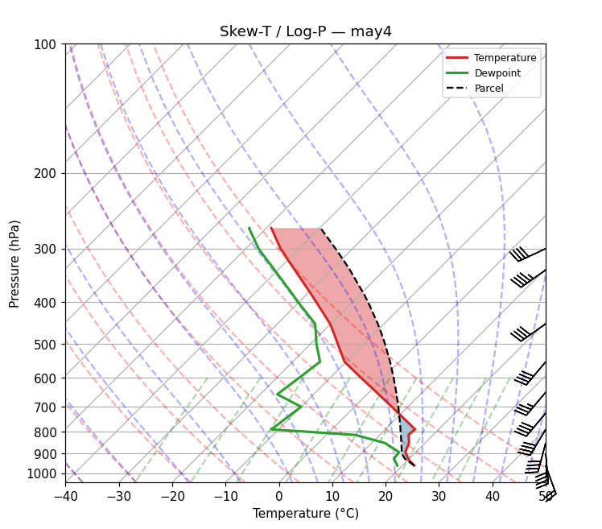

# 🌤️ SkyRead — 探空白話判讀器

> 把艱深的 Skew-T 探空圖，翻成**同行看的指數**與**阿嬤看的帶傘建議**。



## Why

每天全球施放上千顆探空氣球，但讀懂一張 Skew-T 需要多年訓練。
SkyRead 把它變成兩張卡片：給氣象同行的指數摘要，和給長輩的
「要不要帶傘、能不能曬棉被」。

## The honest small-model architecture

| 層 | 負責 | 由誰做 |
|----|------|--------|
| 數值 | CAPE/CIN、LCL/LFC/EL、K、LI、TT、PWAT | **MetPy**（確定性計算，AI 不碰數字） |
| 同行版卡片 | 指數摘要——專業讀者要的就是精確數字 | 規則式模板（確定性） |
| 生活版卡片 | 把建議講成阿嬤聽得懂的人話 | **MiniCPM3-4B**（本機推論，只改寫草稿） |
| 保險 | 模型失敗或輸出不合格時 | 規則式 fallback（同時是 LLM 的草稿） |

小模型算不準 CAPE——所以我們不讓它算。它只做小模型真正擅長、
也是唯一需要它的事：把一句數值正確的天氣提醒，改寫成自然的人話。
改寫結果還要通過驗證（繁中、長度、不得回音指令），不合格就用草稿原文。

## Data sources

- 🛰️ 即時探空：石垣島 47918 / 香港 45004 等鄰近測站（University of Wyoming
  archive；台灣本島測站未開放於該資料庫，故取距離最近者）
- 📚 經典個案：MetPy 內建（含 1999-05-04 Oklahoma tornado outbreak）
- 📄 上傳 CSV：`pressure,temperature,dewpoint,direction,speed`（hPa/°C/deg/kt）

## Run locally

```bash
uv sync
uv run python app.py            # Gradio UI at http://127.0.0.1:7860
uv run python -m skyread.spike  # CLI end-to-end demo
uv run pytest tests/ -v
```

## Built for

Hugging Face **Build Small Hackathon 2026** — Backyard AI track.
